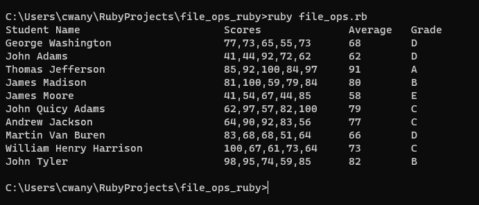

# File Operations Ruby Script

## What it does
This small script was written to understand the basic file operations in Ruby. It includes methods for reading from a CSV file and loading the rows into pre-defined objects. Operations to obtain the average and assign a grade to the student are performed, then the objects are added to a list. The results are then printed on the console in a formatted manner. 

## Why?
The script was created after going through the official [Ruby quickstart guide](https://www.ruby-lang.org/en/documentation/quickstart/). With prior knowledge of Java and its APIs, I wanted to find out if I can utilize Ruby APIs to come up with a small application, as well as practice how to write in a new syntax. 

## Output Screenshot

